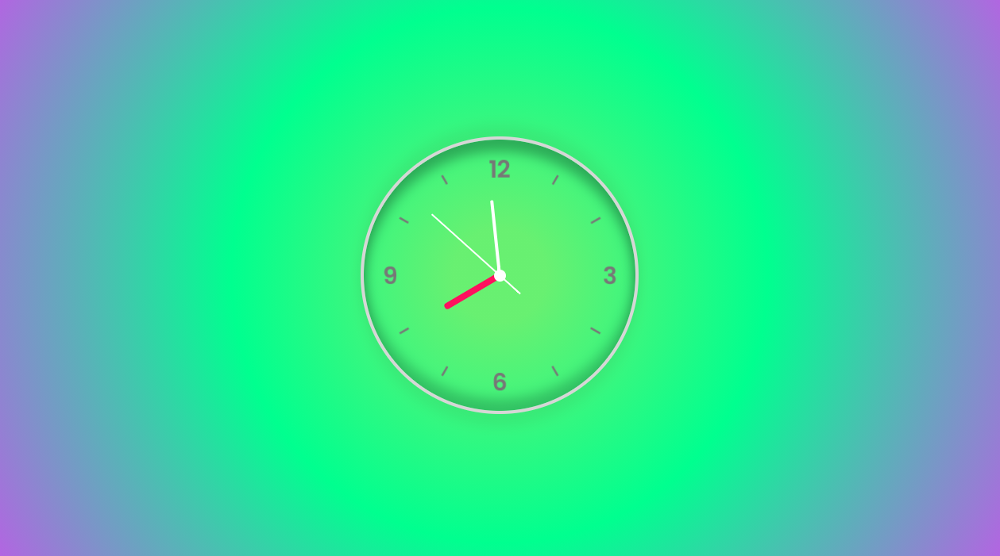

<h1 align="center"><strong>RELÓGIO</strong></h1>

<h1>

</h1>

 <h3 align="center">
<a href="https://luvy.vercel.app"> 🚀 Acessar a demonstração do Relógio</a></h3>

## 📖 ***Sobre***
Um aplicativo de relógio simples para solidificar o aprendizado nas tecnologias HTML5, CSS3 E JAVASCRIPT.

___

## 📌 Tecnologias utilizadas

O projeto foi desenvolvido utilizando as seguintes tecnolgias

- HTML5
- CSS3
- JAVASCRIPT
___
💻 O projeto foi desenvolvido por Thiago Santos.